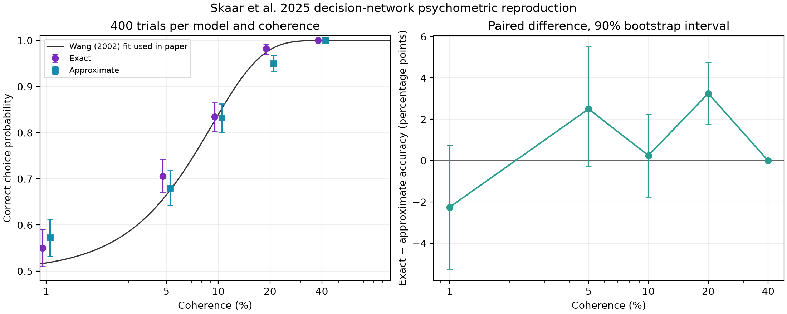

# Concise validation results

## Scope

The evaluation uses the explicit/general Brian2 benchmark from Skaar, Haug and
Plesser (2025), upstream commit
`68e6dd970cfc6bab26459fcb8c34ee0f16560d9e`. The primary CPU contract is
float64, fixed-step RK4 with `dt = 0.1 ms`, one second of biological time and
the original connectivity, delays, state variables and monitoring scope.

## Scientific validation

Identical-event comparisons passed at 640, 2,560, 5,120 and 10,240 neurons. At
10,240 neurons, the maximum voltage error was `8.33e-17 V` and the maximum NMDA
gate error was `3.72e-15`; discrete outputs satisfied the deterministic gate.
The 20,480-neuron run retained all 754,974,720 synapses and 28 finite public
output fields. The deterministic claim ends at 10,240 neurons.

## Matched CPU results

These medians compare original Brian2 and Brian2-Atlas on the same Linux host,
the same eight pinned CPU cores and the same compiled simulation region.

| Neurons | Synapses | Brian2 | Brian2-Atlas | Speedup | Atlas peak RSS |
| ---: | ---: | ---: | ---: | ---: | ---: |
| 2,560 | 11,796,480 | 69.942 s | 61.998 s | 1.13x | +5.5% |
| 5,120 | 47,185,920 | 289.100 s | 194.660 s | 1.49x | +7.3% |
| 10,240 | 188,743,680 | 1,256.384 s | 598.964 s | 2.10x | +7.9% |
| 20,480 | 754,974,720 | 4,443.328 s | 2,271.710 s | 1.96x | +8.3% |

Paper timings from different hardware are not used as speedup denominators.

## Parallel and accelerator observations

At 10,240 neurons on the same 40 physical Linux cores, 40 MPI ranks completed
the simulation in 153.675 s versus 257.774 s for 40 shared-memory workers, a
1.68x advantage. Holding the total rank count at 40 while spreading work across
machines produced little improvement: the 20,480-neuron result changed from
588.812 s on one node to 586.537 s on four nodes. Per-timestep communication
and synchronization limit this placement-scaling experiment.

CUDA tests on L4 and A100 and Metal tests on Apple M3 used a separate float32
scientific contract, so they are not reported as speedups over the float64 CPU
baseline. A general sparse event-delivery improvement reduced Metal warm time
from 40.419 to 20.321 s at 640 neurons and from 261.629 to 110.802 s at 2,560
neurons while preserving the frozen public outputs byte for byte.

## Functional network check

The authors' NEST decision-network fixture was reproduced with 400 matched
exact/approximate trials at each of five coherence values: 2,000 pairs and
4,000 simulations. Both models reproduced the rising decision trend and
sustained selective activity. This comparison validates functional behaviour;
the exact/approximate NEST cost ratio is not a Brian2-Atlas engine speedup.

## Interpretation limits

- Deterministic same-event validation ends at 10,240 neurons.
- CUDA and Metal use float32 and remain separate from the CPU comparison.
- Multi-node measurements hold total MPI ranks fixed and test placement rather
  than increasing-resource strong scaling.
- The NEST fixture uses different simulator semantics and timing scope.
- This package is a result summary, not a backend source release or a complete
  independent reproduction environment.
